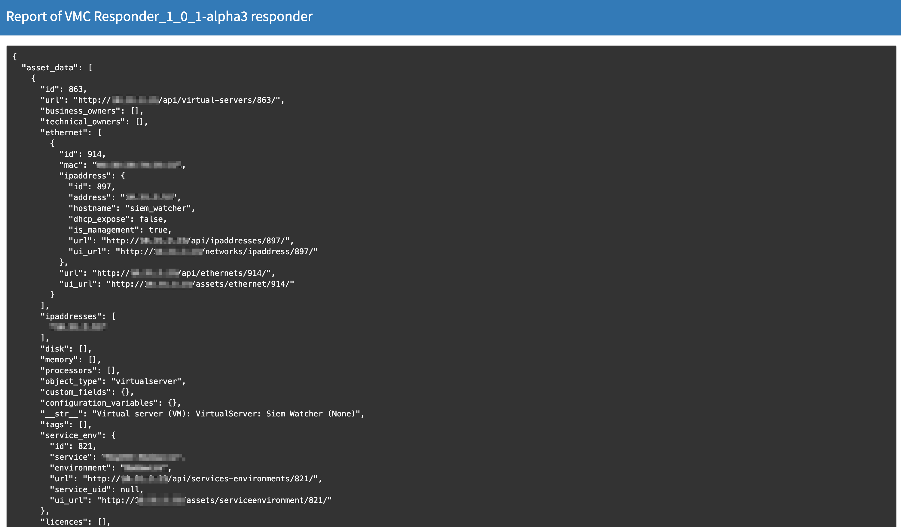
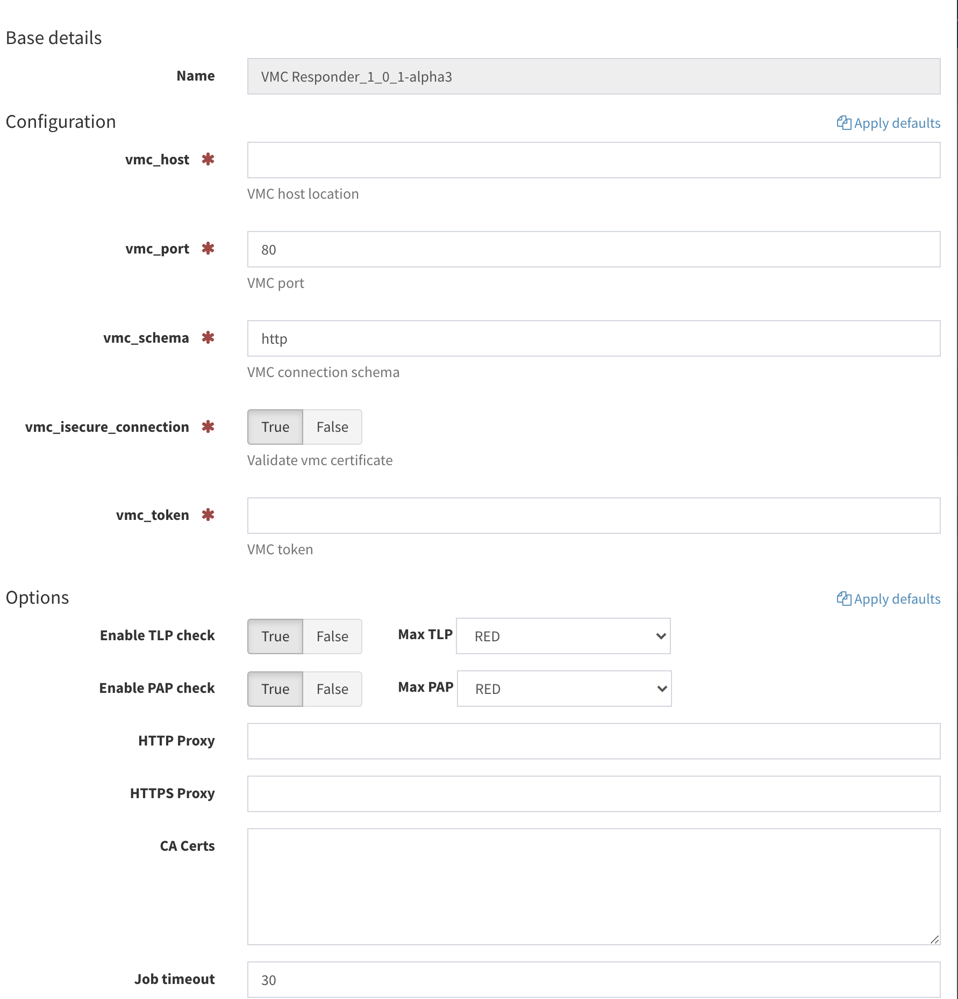

# VMC: The Hive Responder
This responder can be used to fetch additional information about IP's from VMC (vulnerabilities) and Allegro Ralph (asset informations).

Sample response from responder:

### Requirements
- working [VMC](https://github.com/DSecureMe/vmc) instance
- working [Ralph](https://github.com/allegro/ralph) instance
- integrated VMC with Ralph see [docs](https://github.com/DSecureMe/vmc-docs)

### Installation
See `requirements.txt` for dependencies and [cortex documentation](https://github.com/TheHive-Project/CortexDocs).

### Configuration
In the cortex admin panel you need to provide:
- vmc_host (ip address or domain name)
- vmc_port
- vmc_schema (http/https)
- vmc_token

